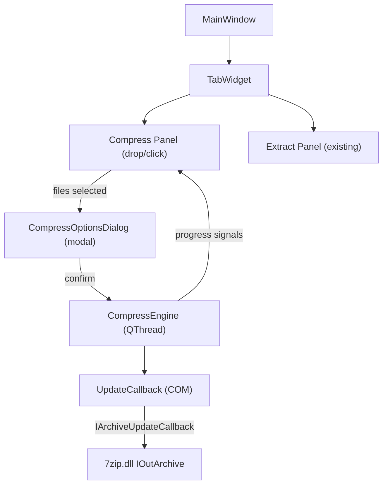
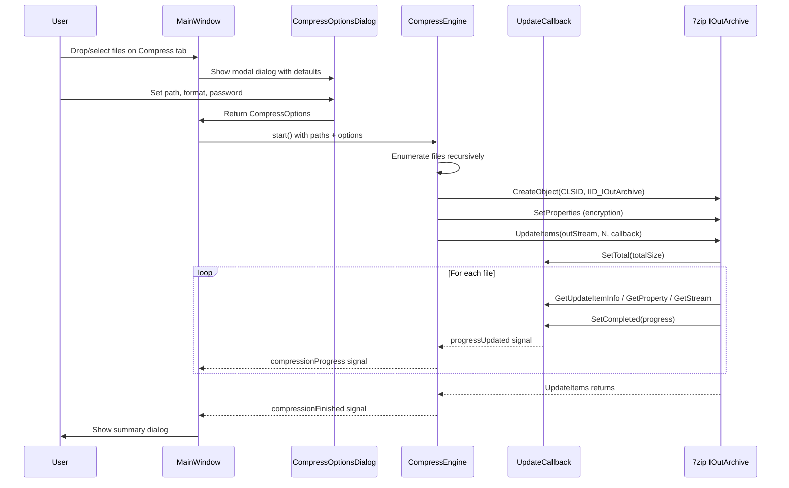

# Add Compression Panel to QuickExtract

## Architecture



## UI Layout Changes

Modify [mainwindow.h](QuickExtract/mainwindow.h) / [mainwindow.cpp](QuickExtract/mainwindow.cpp):

- Replace the flat layout with a **`QTabWidget`** containing two tabs: "Compress" and "Extract"
- **Extract tab**: moves the existing `m_dropLabel` + `m_progressSection` into its own `QWidget` -- all existing logic (extract engine, password prompt, summary) stays unchanged
- **Compress tab**: a new `QWidget` with its own drop label (`m_compressDropLabel`) and progress section (`m_compressProgressSection`), mirroring the extract panel structure
- `dragEnterEvent` / `dropEvent` / `eventFilter` route to either compress or extract flow based on current tab index
- Add `startCompression(const QStringList& paths)` slot and compress-specific progress/cancel/summary handling

## New: CompressOptionsDialog

New files: `compressoptionsdialog.h` / `compressoptionsdialog.cpp`

A modal `QDialog` shown before compression starts. Layout:

- **Output path row**: `QLineEdit` (editable filename, no extension) + `QLabel` (showing extension like `.7z`) + `QPushButton` ("Browse..." to select directory). Default: directory of first input file, name = `completeBaseName` of first file
- **Format row**: `QComboBox` with "7z" and "zip". Changing format updates the extension label
- **Password row**: `QCheckBox` "Encrypt" + `QLineEdit` (password, echo mode Password)
- **Header encryption row**: `QCheckBox` "Encrypt file headers" -- enabled only when format is "7z" and encrypt is checked
- **Buttons**: "Compress" (`QDialogButtonBox::Ok`) and "Cancel" (`QDialogButtonBox::Cancel`)

The dialog exposes a `CompressOptions` struct:

```cpp
struct CompressOptions {
    QString outputPath;       // full path including extension
    QString format;           // "7z" or "zip"
    QString password;         // empty if no encryption
    bool encryptHeaders;      // only meaningful for 7z
};
```

## New: UpdateCallback

New files: `updatecallback.h` / `updatecallback.cpp`

COM callback implementing `IArchiveUpdateCallback` + `ICryptoGetTextPassword2` + `CMyUnknownImp`:

- Pre-built file list: a `QVector<FileItem>` where `FileItem` stores `{relativePath, fullDiskPath, isDir, size, attributes, cTime, mTime, aTime}`
- **`SetTotal` / `SetCompleted`**: emit progress signal, check cancel flag
- **`GetUpdateItemInfo`**: all new items (`*newData = 1`, `*newProps = 1`, `*indexInArchive = (UInt32)-1`)
- **`GetProperty`**: return `kpidPath`, `kpidIsDir`, `kpidSize`, `kpidAttrib`, `kpidCTime`, `kpidMTime`, `kpidATime` from the file list
- **`GetStream`**: return `InStreamWrapper` for files, skip for directories
- **`SetOperationResult`**: count success/failure
- **`CryptoGetTextPassword2`**: set `*passwordIsDefined = !m_password.isEmpty()`, allocate BSTR

## New: CompressEngine

New files: `compressengine.h` / `compressengine.cpp`

`QThread` subclass, similar pattern to `ExtractEngine`:

- Constructor takes `QStringList inputPaths` + `CompressOptions options`
- **`run()`**:
  1. Enumerate input files/directories recursively into `QVector<FileItem>`, computing relative paths from the common parent directory
  2. Load `7zip.dll`, call `CreateObject(&CLSID, &IID_IOutArchive, ...)` using `CLSID_CFormat7z` or `CLSID_CFormatZip` based on format
  3. `QueryInterface(IID_ISetProperties)` to configure encryption: for 7z set `"he"` property if header encryption enabled; password goes through `ICryptoGetTextPassword2`
  4. Create output file with a new `CompressOutStream` (implements `IOutStream` = `ISequentialOutStream` + Seek + SetSize)
  5. Create `UpdateCallback`, connect progress signal
  6. Call `outArchive->UpdateItems(outStream, numItems, updateCallback)`
  7. Emit `compressionFinished(success, errorMsg, elapsedMs)`
- **Signals**: `compressionProgress(quint64, quint64)`, `compressionFinished(bool, QString, qint64)`
- **`cancel()`**: atomic flag, checked in `UpdateCallback::SetCompleted`

## New: CompressOutStream

New file (or extend `outstreamwrapper.h/cpp`): a wrapper implementing `IOutStream` (which inherits `ISequentialOutStream`), providing `Write`, `Seek`, and `SetSize` over a `QFile`. This is required because `IOutArchive::UpdateItems` may query for `IOutStream` for seekable output.

## Existing File Changes

### [guiddef.cpp](QuickExtract/guiddef.cpp)
Add GUIDs:

```cpp
DEFINE_GUID(IID_IOutArchive,
    0x23170F69, 0x40C1, 0x278A, 0x00, 0x00, 0x00, 0x06, 0x00, 0xA0, 0x00, 0x00);
DEFINE_GUID(IID_ISetProperties,
    0x23170F69, 0x40C1, 0x278A, 0x00, 0x00, 0x00, 0x06, 0x00, 0x03, 0x00, 0x00);
DEFINE_GUID(IID_IArchiveUpdateCallback,
    0x23170F69, 0x40C1, 0x278A, 0x00, 0x00, 0x00, 0x06, 0x00, 0x80, 0x00, 0x00);
DEFINE_GUID(IID_ICryptoGetTextPassword2,
    0x23170F69, 0x40C1, 0x278A, 0x00, 0x00, 0x00, 0x05, 0x00, 0x11, 0x00, 0x00);
```

### [archivehelper.h](QuickExtract/archivehelper.h) / [archivehelper.cpp](QuickExtract/archivehelper.cpp)
Add a helper function:

```cpp
HRESULT createOutArchive(const QString& format, CMyComPtr<IOutArchive>& outArchive);
```

This loads `7zip.dll`, calls `CreateObject` with the appropriate CLSID.

### [CMakeLists.txt](QuickExtract/CMakeLists.txt)
Add new source files to the `add_executable` list:
- `compressengine.h/cpp`
- `updatecallback.h/cpp`
- `compressoptionsdialog.h/cpp`
- `compressoutstream.h/cpp` (if separate from outstreamwrapper)

## Data Flow for Compression


